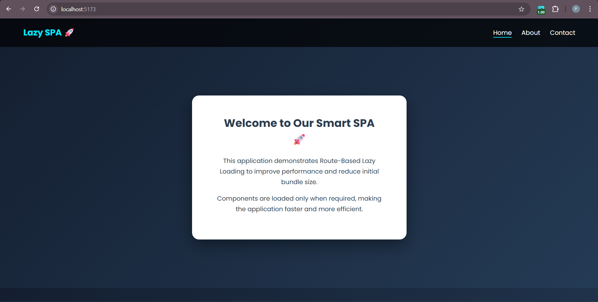
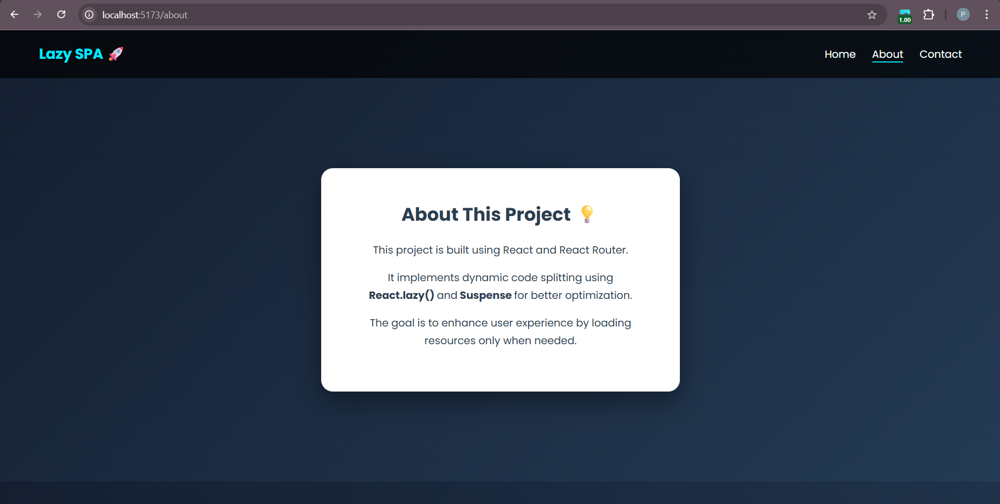
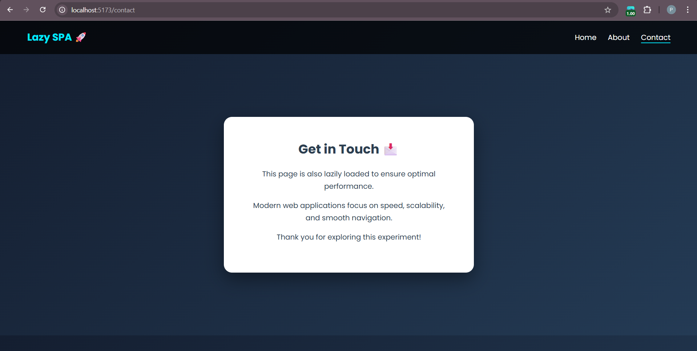

[4:05 PM, 2/17/2026] Priyanshu CU: # 🚀 Lazy Loading in React (Vite)

This project demonstrates how to implement *Lazy Loading (Code Splitting)* in a React application using React.lazy() and Suspense.

---

## 📌 What This Project Shows

- ✅ Component-based architecture
- ✅ Lazy loading using React.lazy()
- ✅ Suspense fallback UI
- ✅ Code splitting with Vite
- ✅ Clean folder structure

---

## 🛠️ Tech Stack

- React
- Vite
- JavaScript (ES6+)
- CSS

---

## 📸 Screenshots

### 🖥 Dashboard View

---

### ⏳ Loading State

---

## 🎯 Learning Outcome

This project helped in understanding:

- Why lazy loading improves performance
- How React Suspense works
- How Vite handles dynamic imports
- Real-world u…
[4:13 PM, 2/17/2026] Priyanshu CU: # 🚀 Route-Based Lazy Loading in React (SPA)

## 📌 Project Overview

This project demonstrates *Route-Based Lazy Loading* in a React Single Page Application (SPA) using:

- React
- React Router DOM
- React.lazy()
- Suspense

Lazy loading improves performance by loading components only when they are required instead of loading all components at once.

---

## 🛠 Technologies Used

- React (Vite)
- React Router DOM
- JavaScript (ES6+)
- CSS3

---

## 📸 Screenshots

### 🏠 Home Page

---

### ⏳ About Page 

---

### 📞 Contact Page 

---

### 📄 Loading Page

