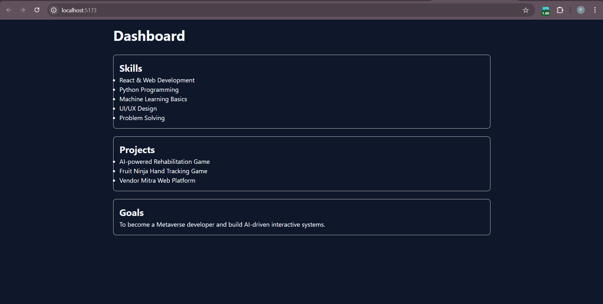
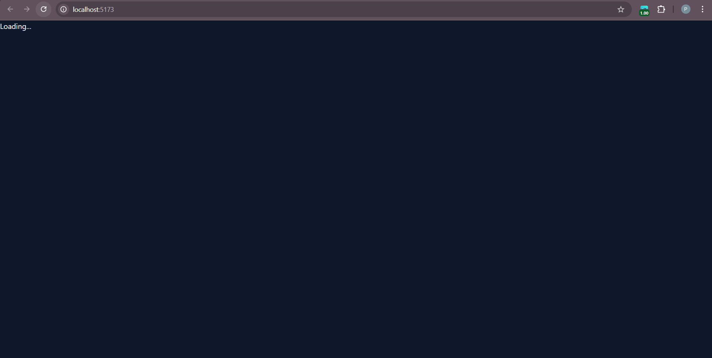

# 🚀 Lazy Loading in React (Vite)

This project demonstrates how to implement **Lazy Loading (Code Splitting)** in a React application using `React.lazy()` and `Suspense`.

---

## 📌 What This Project Shows

- ✅ Component-based architecture
- ✅ Lazy loading using `React.lazy()`
- ✅ Suspense fallback UI
- ✅ Code splitting with Vite
- ✅ Clean folder structure

---

## 🛠️ Tech Stack

- React
- Vite
- JavaScript (ES6+)
- CSS

---

## 📸 Screenshots

### 🖥 Dashboard View

---

### ⏳ Loading State

---

## 🎯 Learning Outcome

This project helped in understanding:

- Why lazy loading improves performance
- How React Suspense works
- How Vite handles dynamic imports
- Real-world usage of code splitting

---

## ⭐ If You Like This

Give this repo a ⭐ and feel free to fork it!